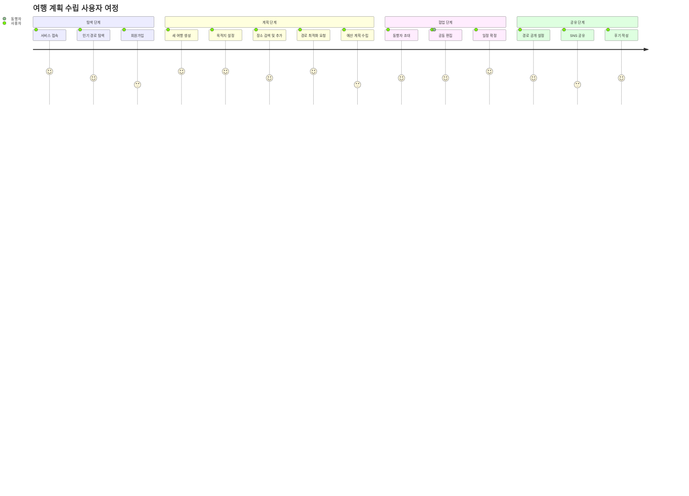
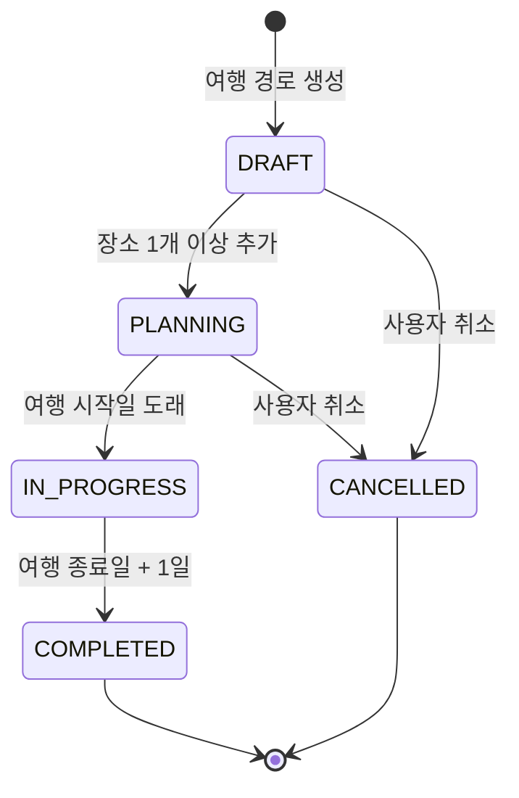
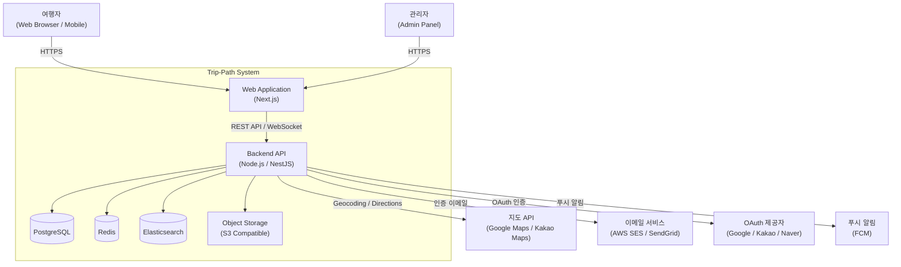
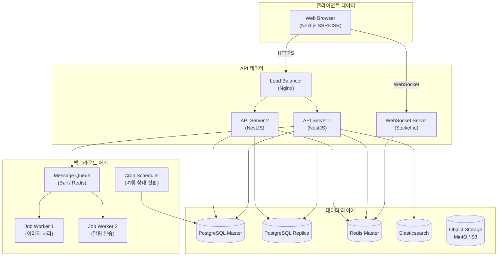
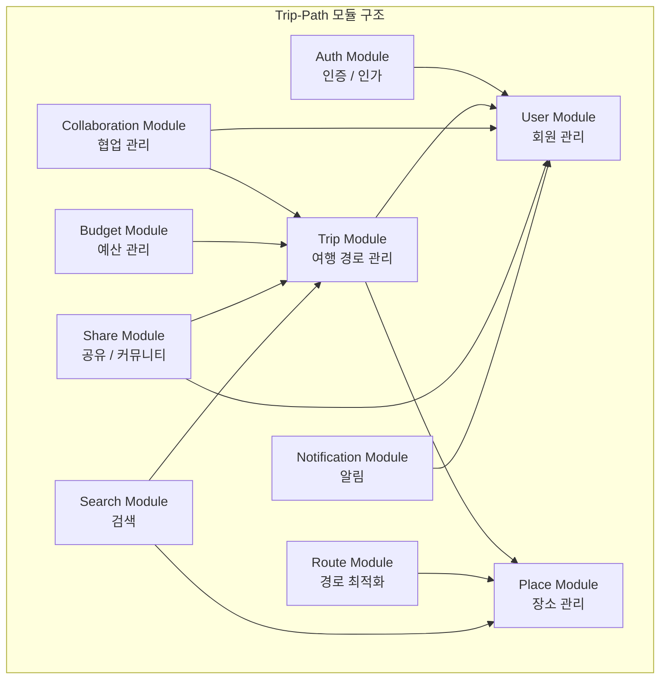
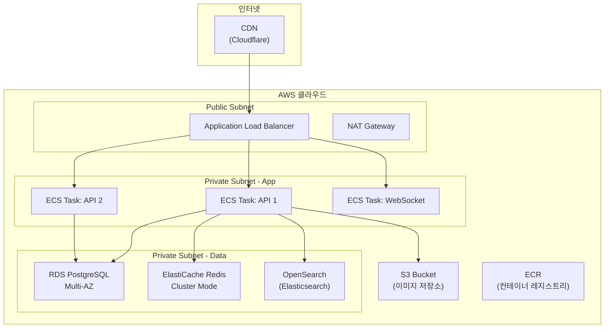
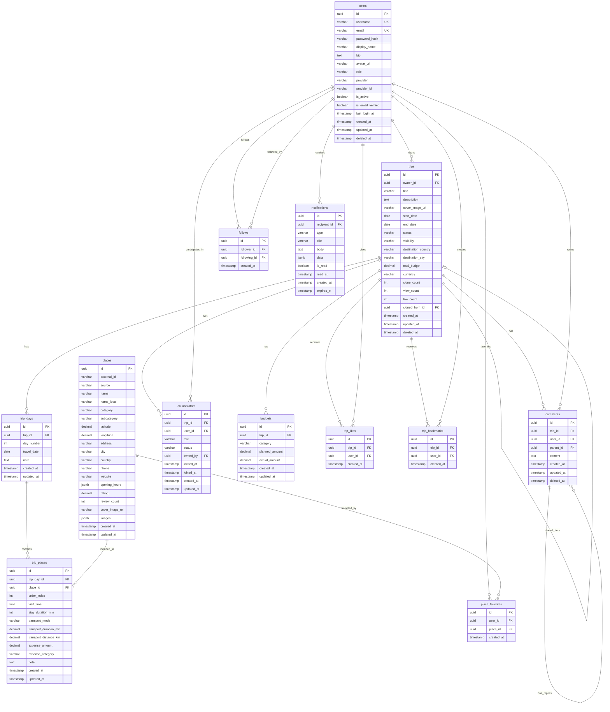

# Trip-Path 여행 경로 플래닝 서비스 - 비즈니스 아키텍처 설계서

**문서 버전**: 1.0.0
**작성일**: 2026-02-17
**작성자**: Architecture & Business Analysis Team
**상태**: Draft

---

## 목차

1. [프로젝트 개요](#1-프로젝트-개요)
2. [핵심 기능 정의](#2-핵심-기능-정의)
3. [비즈니스 룰 정의서](#3-비즈니스-룰-정의서)
4. [시스템 아키텍처 설계](#4-시스템-아키텍처-설계)
5. [데이터 모델 설계서](#5-데이터-모델-설계서)
6. [API 명세서](#6-api-명세서)
7. [기술 스택 추천](#7-기술-스택-추천)
8. [구현 가이드](#8-구현-가이드)

---

## 1. 프로젝트 개요

### 1.1 서비스 소개

**Trip-Path**는 여행자가 여행 경로를 체계적으로 계획하고, 저장하고, 공유할 수 있는 웹 기반 여행 경로 플래닝 서비스입니다.

단순한 일정 나열을 넘어, 장소 간 이동 경로 최적화, 소요 시간 추정, 예산 관리, 협업 기능을 통해 개인 여행자부터 그룹 여행까지 지원하는 통합 여행 계획 플랫폼입니다.

### 1.2 목표 사용자 (Target Users)

| 사용자 유형 | 설명 |
|------------|------|
| 개인 여행자 | 혼자 또는 소규모로 여행을 계획하는 일반 사용자 |
| 그룹 여행 조직자 | 단체 여행 일정을 조율하는 리더 사용자 |
| 여행사 / 플래너 | 고객에게 여행 상품을 제안하는 전문 사용자 |
| 여행 콘텐츠 크리에이터 | 자신의 여행 경로를 공유하고 수익화하는 사용자 |

### 1.3 서비스 목표

- 여행 계획 수립 시간 50% 단축
- 장소 간 이동 경로 자동 최적화
- 커뮤니티 기반 여행 경로 공유 생태계 구축
- 실시간 협업을 통한 그룹 여행 계획 지원

### 1.4 서비스 범위 (In Scope)

- 여행 경로(Trip) 생성, 수정, 삭제, 조회
- 장소(Place) 검색 및 일정 추가
- 경로 최적화 및 이동 수단별 소요 시간 계산
- 예산 계획 및 트래킹
- 여행 경로 공유 및 복제(Clone)
- 사용자 인증 및 프로필 관리
- 협업(Collaboration) 기능
- 여행 후기(Review) 및 평점

---

## 2. 핵심 기능 정의

### 2.1 기능 구조도 (Feature Map)

```
Trip-Path
├── 사용자 관리 (User Management)
│   ├── 회원가입 / 로그인 (소셜 로그인 포함)
│   ├── 프로필 관리
│   └── 팔로우 / 팔로워
│
├── 여행 경로 관리 (Trip Management)
│   ├── 여행 생성 / 수정 / 삭제
│   ├── 날짜별 일정 구성 (Day Plan)
│   ├── 장소 추가 / 순서 변경
│   └── 이동 수단 설정
│
├── 장소 탐색 (Place Discovery)
│   ├── 장소 검색 (키워드 / 카테고리 / 지역)
│   ├── 지도 기반 탐색
│   ├── 장소 상세 정보 (영업시간, 평점, 사진)
│   └── 즐겨찾기
│
├── 경로 최적화 (Route Optimization)
│   ├── 최단 거리 경로 계산
│   ├── 이동 수단별 소요 시간 추정
│   └── 방문 순서 최적화 제안
│
├── 예산 관리 (Budget Management)
│   ├── 총 예산 설정
│   ├── 항목별 예산 배분 (숙박, 식비, 교통, 관광)
│   └── 실시간 예산 초과 알림
│
├── 협업 (Collaboration)
│   ├── 공동 편집자 초대
│   ├── 권한 관리 (Owner / Editor / Viewer)
│   └── 실시간 동시 편집
│
├── 공유 & 커뮤니티 (Share & Community)
│   ├── 여행 경로 공개 / 비공개 설정
│   ├── 경로 복제(Clone)
│   ├── 좋아요 / 북마크
│   └── 댓글 / 후기
│
└── 알림 (Notification)
    ├── 협업 초대 알림
    ├── 여행 D-Day 알림
    └── 예산 초과 알림
```

### 2.2 사용자 여정 (User Journey)



---

## 3. 비즈니스 룰 정의서

### 3.1 비즈니스 룰 카탈로그 개요

| 분류 | 규칙 수 | 설명 |
|------|---------|------|
| 핵심 규칙 (Core Rules) | 12 | 서비스의 핵심 동작을 정의하는 규칙 |
| 파생 규칙 (Derived Rules) | 8 | 핵심 규칙에서 파생된 보조 규칙 |
| 제약 조건 (Constraints) | 10 | 데이터 무결성 및 시스템 제약 |
| 계산 규칙 (Computation Rules) | 6 | 수치 계산 관련 규칙 |

---

### 3.2 핵심 규칙 (Core Rules)

#### BR-USER-001: 회원가입 이메일 인증

| 항목 | 내용 |
|------|------|
| **Rule ID** | BR-USER-001 |
| **Rule Name** | 회원가입 이메일 인증 의무화 |
| **Description** | 이메일로 가입 시 반드시 이메일 인증을 완료해야 서비스를 정상 이용할 수 있다. |
| **Trigger Condition** | 사용자가 이메일/패스워드로 회원가입 요청 시 |
| **Action** | 인증 토큰이 포함된 이메일 발송, 24시간 내 미인증 시 계정 비활성화 |
| **Exception Handling** | 소셜 로그인(Google, Kakao, Naver) 사용 시 이메일 인증 면제 |
| **Priority** | Critical |
| **Dependencies** | BR-USER-002 |

#### BR-USER-002: 사용자 역할(Role) 정의

| 항목 | 내용 |
|------|------|
| **Rule ID** | BR-USER-002 |
| **Rule Name** | 사용자 역할 및 권한 체계 |
| **Description** | 시스템 내 사용자는 GUEST, MEMBER, PLANNER, ADMIN 4가지 역할로 구분된다. |
| **Trigger Condition** | 회원가입 완료 시 / 관리자의 역할 변경 시 |
| **Action** | 아래 권한 매트릭스에 따라 기능 접근 제어 |
| **Exception Handling** | 역할 다운그레이드 시 기존 데이터는 보존, 기능만 제한 |
| **Priority** | Critical |
| **Dependencies** | - |

**권한 매트릭스:**

| 기능 | GUEST | MEMBER | PLANNER | ADMIN |
|------|-------|--------|---------|-------|
| 공개 여행 경로 조회 | O | O | O | O |
| 여행 경로 생성 | X | O | O | O |
| 여행 경로 공유/판매 | X | X | O | O |
| 사용자 관리 | X | X | X | O |
| 월 최대 생성 경로 수 | - | 10개 | 무제한 | 무제한 |

#### BR-TRIP-001: 여행 경로 생성 기본 규칙

| 항목 | 내용 |
|------|------|
| **Rule ID** | BR-TRIP-001 |
| **Rule Name** | 여행 경로 생성 필수 조건 |
| **Description** | 여행 경로 생성 시 반드시 제목, 여행 시작일, 여행 종료일을 입력해야 한다. |
| **Trigger Condition** | 사용자가 새 여행 경로 생성 API 호출 시 |
| **Action** | 필수 필드 검증 후 여행 경로 생성 |
| **Exception Handling** | 필수 필드 누락 시 400 Bad Request 반환 |
| **Priority** | Critical |
| **Dependencies** | BR-TRIP-002, BR-DATE-001 |

#### BR-TRIP-002: 여행 기간 제한

| 항목 | 내용 |
|------|------|
| **Rule ID** | BR-TRIP-002 |
| **Rule Name** | 여행 최대 기간 제한 |
| **Description** | 단일 여행 경로의 최대 기간은 90일이며, 최소 기간은 당일(1일)이다. |
| **Trigger Condition** | 여행 경로 생성 또는 날짜 수정 시 |
| **Action** | 시작일과 종료일 차이 검증 |
| **Exception Handling** | 90일 초과 시 422 Unprocessable Entity 반환, 메시지: "여행 기간은 최대 90일입니다." |
| **Priority** | High |
| **Dependencies** | BR-TRIP-001 |

#### BR-DATE-001: 날짜 유효성 검증

| 항목 | 내용 |
|------|------|
| **Rule ID** | BR-DATE-001 |
| **Rule Name** | 여행 날짜 유효성 검증 |
| **Description** | 여행 시작일은 오늘 이후이어야 하며, 종료일은 시작일과 같거나 이후이어야 한다. |
| **Trigger Condition** | 여행 경로 생성 또는 날짜 수정 시 |
| **Action** | 날짜 범위 및 순서 검증 |
| **Exception Handling** | 과거 날짜 입력 시 경고(Warning)는 표시하되 저장은 허용 (기존 계획 수정 지원) |
| **Priority** | High |
| **Dependencies** | - |

#### BR-PLACE-001: 장소 추가 규칙

| 항목 | 내용 |
|------|------|
| **Rule ID** | BR-PLACE-001 |
| **Rule Name** | 일별 최대 장소 추가 제한 |
| **Description** | 여행 일정의 하루에 추가할 수 있는 장소는 최대 20개이다. |
| **Trigger Condition** | 사용자가 특정 날짜의 일정에 장소 추가 요청 시 |
| **Action** | 해당 날짜의 기존 장소 수 카운트 후 제한 검증 |
| **Exception Handling** | 20개 초과 시 409 Conflict 반환, 메시지: "하루 최대 20개 장소까지 추가 가능합니다." |
| **Priority** | Medium |
| **Dependencies** | BR-TRIP-001 |

#### BR-PLACE-002: 중복 장소 추가 경고

| 항목 | 내용 |
|------|------|
| **Rule ID** | BR-PLACE-002 |
| **Rule Name** | 동일 날짜 중복 장소 경고 |
| **Description** | 동일한 날짜에 이미 추가된 장소를 다시 추가하려 하면 경고를 표시한다. |
| **Trigger Condition** | 장소 추가 시 동일 날짜 내 동일 place_id 존재 확인 |
| **Action** | 경고 메시지 반환, 사용자 확인 후 중복 추가 허용 |
| **Exception Handling** | 사용자가 확인하면 중복 추가 허용 (force=true 파라미터) |
| **Priority** | Medium |
| **Dependencies** | BR-PLACE-001 |

#### BR-COLLAB-001: 협업 초대 규칙

| 항목 | 내용 |
|------|------|
| **Rule ID** | BR-COLLAB-001 |
| **Rule Name** | 협업 초대 및 권한 부여 |
| **Description** | 여행 경로 소유자(OWNER)만 다른 사용자를 협업자로 초대할 수 있다. |
| **Trigger Condition** | 협업자 초대 API 호출 시 |
| **Action** | 초대 이메일 발송 또는 앱 내 알림 전송, 초대 링크 유효 기간 7일 |
| **Exception Handling** | 이미 협업자인 경우 409 반환. 본인 초대 시 400 반환 |
| **Priority** | High |
| **Dependencies** | BR-COLLAB-002, BR-USER-002 |

#### BR-COLLAB-002: 협업자 권한 체계

| 항목 | 내용 |
|------|------|
| **Rule ID** | BR-COLLAB-002 |
| **Rule Name** | 협업자 역할별 권한 |
| **Description** | 여행 경로 내 협업자는 OWNER, EDITOR, VIEWER 3가지 역할을 가진다. |
| **Trigger Condition** | 협업자 초대 시 또는 권한 변경 시 |
| **Action** | 역할에 따라 편집/조회 권한 차등 부여 |
| **Exception Handling** | OWNER가 1명 이상 유지되어야 함. 마지막 OWNER 탈퇴 시 다음 EDITOR 자동 승격 |
| **Priority** | High |
| **Dependencies** | BR-COLLAB-001 |

**협업자 권한 매트릭스:**

| 기능 | OWNER | EDITOR | VIEWER |
|------|-------|--------|--------|
| 장소 추가/수정/삭제 | O | O | X |
| 날짜/제목 수정 | O | X | X |
| 협업자 초대/삭제 | O | X | X |
| 여행 삭제 | O | X | X |
| 예산 수정 | O | O | X |
| 조회 | O | O | O |

#### BR-SHARE-001: 여행 경로 공개 규칙

| 항목 | 내용 |
|------|------|
| **Rule ID** | BR-SHARE-001 |
| **Rule Name** | 공개 여행 경로 최소 조건 |
| **Description** | 여행 경로를 공개로 설정하려면 최소 1개 이상의 장소와 여행 날짜가 설정되어 있어야 한다. |
| **Trigger Condition** | 여행 경로 공개 설정 변경 시 |
| **Action** | 공개 조건 검증 후 상태 변경 |
| **Exception Handling** | 조건 미충족 시 400 반환, 메시지: "공개하려면 최소 1개 이상의 장소를 추가해주세요." |
| **Priority** | Medium |
| **Dependencies** | BR-TRIP-001 |

#### BR-SHARE-002: 여행 경로 클론(Clone) 규칙

| 항목 | 내용 |
|------|------|
| **Rule ID** | BR-SHARE-002 |
| **Rule Name** | 공개 여행 경로 클론 |
| **Description** | 공개된 여행 경로는 로그인한 모든 사용자가 복제할 수 있다. 클론된 경로는 새로운 독립적인 경로로 생성된다. |
| **Trigger Condition** | 사용자가 공개 여행 경로 클론 요청 시 |
| **Action** | 원본 경로의 모든 장소와 설정을 복사하여 새 경로 생성, clone_count 증가 |
| **Exception Handling** | 비공개 경로 클론 시도 시 403 반환 |
| **Priority** | Medium |
| **Dependencies** | BR-SHARE-001 |

#### BR-BUDGET-001: 예산 관리 규칙

| 항목 | 내용 |
|------|------|
| **Rule ID** | BR-BUDGET-001 |
| **Rule Name** | 예산 설정 및 초과 알림 |
| **Description** | 여행 예산 설정 시 카테고리별 예산의 합계는 총 예산을 초과할 수 없다. 예산 80% 도달 시 경고, 100% 초과 시 알림을 발송한다. |
| **Trigger Condition** | 예산 항목 추가/수정 시 |
| **Action** | 카테고리 합계 vs 총 예산 비교, 임계치 도달 시 알림 생성 |
| **Exception Handling** | 총 예산 미설정 시 카테고리 합계 제한 없음 |
| **Priority** | Medium |
| **Dependencies** | BR-CALC-001 |

---

### 3.3 파생 규칙 (Derived Rules)

#### BR-DER-001: 여행 상태 자동 전환

| 항목 | 내용 |
|------|------|
| **Rule ID** | BR-DER-001 |
| **Rule Name** | 날짜 기반 여행 상태 자동 전환 |
| **Description** | 여행 경로의 상태는 날짜에 따라 자동으로 전환된다. |
| **Trigger Condition** | 매일 자정(00:00 KST) 스케줄러 실행 |
| **Action** | 시작일 도래 시 PLANNING → IN_PROGRESS, 종료일 다음 날 IN_PROGRESS → COMPLETED |
| **Priority** | Medium |
| **Dependencies** | BR-TRIP-001, BR-DATE-001 |

**상태 전환 다이어그램:**



#### BR-DER-002: 여행 경로 통계 집계

| 항목 | 내용 |
|------|------|
| **Rule ID** | BR-DER-002 |
| **Rule Name** | 공개 경로 통계 자동 집계 |
| **Description** | 공개된 여행 경로의 조회수, 좋아요 수, 클론 수는 실시간으로 집계된다. |
| **Trigger Condition** | 조회/좋아요/클론 이벤트 발생 시 |
| **Action** | trip_stats 테이블 업데이트 (조회수는 동일 사용자 24시간 내 중복 카운트 방지) |
| **Priority** | Low |
| **Dependencies** | BR-SHARE-001 |

#### BR-DER-003: 인기 경로 선정

| 항목 | 내용 |
|------|------|
| **Rule ID** | BR-DER-003 |
| **Rule Name** | 인기 여행 경로 자동 선정 |
| **Description** | 최근 7일 내 좋아요 수 + 클론 수 * 2 + 조회수 * 0.1 점수가 높은 경로 TOP 50을 인기 경로로 선정한다. |
| **Trigger Condition** | 매일 오전 6시 배치 작업 |
| **Action** | 인기 경로 캐시 갱신 |
| **Priority** | Low |
| **Dependencies** | BR-DER-002 |

#### BR-DER-004: 사용자 팔로우 기반 피드

| 항목 | 내용 |
|------|------|
| **Rule ID** | BR-DER-004 |
| **Rule Name** | 팔로우 기반 여행 경로 피드 |
| **Description** | 사용자 피드는 팔로우한 사용자의 최근 공개 여행 경로를 최신순으로 보여준다. 팔로우 경로가 없는 경우 인기 경로로 대체한다. |
| **Trigger Condition** | 피드 조회 API 호출 시 |
| **Action** | 팔로우 목록 기반 쿼리, 결과 없으면 인기 경로 fallback |
| **Priority** | Medium |
| **Dependencies** | BR-DER-003 |

---

### 3.4 제약 조건 (Constraints)

#### BR-CON-001: 사용자명 유니크 제약

- 사용자명(username)은 시스템 내 유일해야 한다.
- 영문, 숫자, 언더스코어(_)만 허용, 3~30자 제한

#### BR-CON-002: 비밀번호 복잡도 제약

- 최소 8자, 영문 대소문자 + 숫자 + 특수문자 각 1개 이상 포함
- 최근 3회 사용한 비밀번호 재사용 불가

#### BR-CON-003: 장소 정보 무결성

- 장소는 유효한 위도(-90 ~ 90)와 경도(-180 ~ 180) 값을 가져야 한다.
- 장소 이름은 최대 200자

#### BR-CON-004: 여행 경로 소프트 삭제

- 여행 경로는 물리적으로 삭제하지 않고 소프트 삭제(deleted_at 설정)한다.
- 클론된 경로의 원본이 삭제되어도 클론 경로는 독립적으로 유지된다.

#### BR-CON-005: 협업자 최대 인원

- 단일 여행 경로의 협업자는 최대 20명(OWNER 포함)이다.

#### BR-CON-006: API Rate Limiting

- 비인증 사용자: 분당 30회
- 인증 사용자 (MEMBER): 분당 100회
- 인증 사용자 (PLANNER): 분당 300회

#### BR-CON-007: 이미지 업로드 제약

- 장소/여행 커버 이미지 최대 크기: 10MB
- 허용 형식: JPEG, PNG, WebP
- 이미지 자동 리사이징: 썸네일(200x200), 미디엄(800x600), 풀(1920x1080)

#### BR-CON-008: 댓글 제약

- 댓글 최대 길이: 500자
- 대댓글은 1단계까지만 허용 (대댓글의 대댓글 불가)

#### BR-CON-009: 검색 제약

- 검색 키워드 최소 2자
- 검색 결과 최대 페이지: 100 (페이지당 20개, 총 2,000개)

#### BR-CON-010: 알림 보관 기간

- 알림은 수신 후 90일간 보관, 이후 자동 삭제

---

### 3.5 계산 규칙 (Computation Rules)

#### BR-CALC-001: 예산 잔여액 계산

```
잔여 예산 = 총 예산 - 지출 항목 합계
예산 사용률 = (지출 항목 합계 / 총 예산) * 100
```

#### BR-CALC-002: 경로 총 이동 거리 계산

```
Haversine 공식 사용:
두 지점 간 거리 = 2 * R * arcsin(sqrt(sin²((lat2-lat1)/2) + cos(lat1)*cos(lat2)*sin²((lon2-lon1)/2)))
R = 지구 반지름 = 6371km

총 이동 거리 = Σ(인접 장소 간 거리)
```

#### BR-CALC-003: 예상 이동 시간 계산

```
도보 이동 시간(분) = 거리(km) / 4 * 60        (평균 도보 속도 4km/h)
자전거 이동 시간(분) = 거리(km) / 15 * 60      (평균 15km/h)
자동차 이동 시간(분) = 거리(km) / 40 * 60      (도심 평균 40km/h)
대중교통 이동 시간(분) = 거리(km) / 25 * 60    (평균 25km/h, 환승 포함)
```

#### BR-CALC-004: 여행 경로 점수 계산 (인기도)

```
인기도 점수 = (좋아요 수 * 3) + (클론 수 * 5) + (댓글 수 * 2) + (조회수 * 0.1)
기간 가중치 = 최근 7일 이내 활동에 2배 가중치 적용
최종 점수 = 인기도 점수 * 기간 가중치
```

#### BR-CALC-005: 여행 일정 밀도 계산

```
일정 밀도 = 장소 수 / 여행 일수
권장 밀도: 3~7 (하루 3~7개 장소)
밀도 > 7: "일정이 과밀합니다" 경고
밀도 < 2: "일정이 여유롭습니다" 안내
```

#### BR-CALC-006: 협업 활동 점수

```
협업 점수 = 장소 추가 수 * 2 + 댓글 수 * 1 + 수정 횟수 * 1
최근 30일 기준 집계, 기여도 순위 표시
```

---

## 4. 시스템 아키텍처 설계

### 4.1 아키텍처 결정 기록 (ADR)

#### ADR-001: 마이크로서비스 vs 모놀리식 선택

| 항목 | 내용 |
|------|------|
| **상태** | Accepted |
| **결정** | 모듈형 모놀리식(Modular Monolith)으로 시작, 이후 점진적 마이크로서비스 전환 |
| **이유** | 초기 팀 규모(3~7명)와 서비스 초기 단계를 고려하여 개발 속도 우선. 모듈 경계를 명확히 하여 추후 분리 가능하게 설계 |
| **결과** | 빠른 초기 출시, 명확한 도메인 경계, 추후 마이크로서비스 전환 용이 |
| **Trade-offs** | 단일 배포 단위로 인한 독립 스케일링 불가. 트래픽 증가 시 전환 비용 발생 |

#### ADR-002: 실시간 협업 기술 선택

| 항목 | 내용 |
|------|------|
| **상태** | Accepted |
| **결정** | WebSocket + CRDT(Conflict-free Replicated Data Type) 방식 채택 |
| **이유** | 동시 편집 시 충돌 없는 데이터 병합 필요. Operational Transform 대비 구현 복잡도 낮음 |
| **Trade-offs** | 초기 구현 복잡도 높음. 추후 Yjs 라이브러리 활용으로 복잡도 감소 가능 |

#### ADR-003: 데이터베이스 선택

| 항목 | 내용 |
|------|------|
| **상태** | Accepted |
| **결정** | Primary DB: PostgreSQL, Cache: Redis, Search: Elasticsearch |
| **이유** | PostgreSQL의 JSON 지원과 PostGIS 확장으로 지리 데이터 처리. Redis로 세션/캐시. Elasticsearch로 장소 풀텍스트 검색 |
| **Trade-offs** | 다중 DB 운영 복잡도 증가. 초기에는 Elasticsearch 없이 PostgreSQL FTS로 시작 가능 |

---

### 4.2 시스템 아키텍처 다이어그램

#### C4 Level 1: 시스템 컨텍스트 다이어그램



#### C4 Level 2: 컨테이너 다이어그램



#### C4 Level 3: 모듈 구조 다이어그램



---

### 4.3 배포 아키텍처



---

## 5. 데이터 모델 설계서

### 5.1 ERD (Entity Relationship Diagram)



---

### 5.2 테이블 상세 명세

#### Table: users (사용자)

| 컬럼명 | 타입 | NULL | 기본값 | 설명 |
|--------|------|------|--------|------|
| id | UUID | NOT NULL | gen_random_uuid() | PK |
| username | VARCHAR(30) | NOT NULL | - | 사용자명 (유니크) |
| email | VARCHAR(255) | NOT NULL | - | 이메일 (유니크) |
| password_hash | VARCHAR(255) | NULL | - | bcrypt 해시 비밀번호 |
| display_name | VARCHAR(50) | NOT NULL | - | 표시 이름 |
| bio | TEXT | NULL | - | 자기소개 |
| avatar_url | VARCHAR(500) | NULL | - | 프로필 이미지 URL |
| role | VARCHAR(20) | NOT NULL | 'MEMBER' | GUEST/MEMBER/PLANNER/ADMIN |
| provider | VARCHAR(20) | NULL | - | google/kakao/naver/local |
| provider_id | VARCHAR(255) | NULL | - | OAuth 제공자 사용자 ID |
| is_active | BOOLEAN | NOT NULL | true | 계정 활성화 여부 |
| is_email_verified | BOOLEAN | NOT NULL | false | 이메일 인증 여부 |
| last_login_at | TIMESTAMPTZ | NULL | - | 마지막 로그인 일시 |
| created_at | TIMESTAMPTZ | NOT NULL | now() | 생성일시 |
| updated_at | TIMESTAMPTZ | NOT NULL | now() | 수정일시 |
| deleted_at | TIMESTAMPTZ | NULL | - | 소프트 삭제 일시 |

**인덱스:**
- `idx_users_email` ON email (로그인 조회)
- `idx_users_username` ON username (프로필 조회)
- `idx_users_deleted_at` ON deleted_at WHERE deleted_at IS NULL (소프트 삭제 필터)

---

#### Table: trips (여행 경로)

| 컬럼명 | 타입 | NULL | 기본값 | 설명 |
|--------|------|------|--------|------|
| id | UUID | NOT NULL | gen_random_uuid() | PK |
| owner_id | UUID | NOT NULL | - | FK → users.id |
| title | VARCHAR(200) | NOT NULL | - | 여행 제목 |
| description | TEXT | NULL | - | 여행 설명 |
| cover_image_url | VARCHAR(500) | NULL | - | 커버 이미지 URL |
| start_date | DATE | NOT NULL | - | 여행 시작일 |
| end_date | DATE | NOT NULL | - | 여행 종료일 |
| status | VARCHAR(20) | NOT NULL | 'DRAFT' | DRAFT/PLANNING/IN_PROGRESS/COMPLETED/CANCELLED |
| visibility | VARCHAR(20) | NOT NULL | 'PRIVATE' | PRIVATE/PUBLIC/UNLISTED |
| destination_country | VARCHAR(100) | NULL | - | 목적지 국가 |
| destination_city | VARCHAR(100) | NULL | - | 목적지 도시 |
| total_budget | DECIMAL(12,2) | NULL | - | 총 예산 |
| currency | VARCHAR(3) | NOT NULL | 'KRW' | 통화 코드 (ISO 4217) |
| clone_count | INT | NOT NULL | 0 | 클론 횟수 |
| view_count | INT | NOT NULL | 0 | 조회 횟수 |
| like_count | INT | NOT NULL | 0 | 좋아요 수 |
| cloned_from_id | UUID | NULL | - | FK → trips.id (원본 경로) |
| created_at | TIMESTAMPTZ | NOT NULL | now() | 생성일시 |
| updated_at | TIMESTAMPTZ | NOT NULL | now() | 수정일시 |
| deleted_at | TIMESTAMPTZ | NULL | - | 소프트 삭제 일시 |

**인덱스:**
- `idx_trips_owner_id` ON owner_id
- `idx_trips_visibility_status` ON (visibility, status) WHERE deleted_at IS NULL
- `idx_trips_start_date` ON start_date
- `idx_trips_created_at` ON created_at DESC

---

#### Table: trip_days (여행 일별 일정)

| 컬럼명 | 타입 | NULL | 기본값 | 설명 |
|--------|------|------|--------|------|
| id | UUID | NOT NULL | gen_random_uuid() | PK |
| trip_id | UUID | NOT NULL | - | FK → trips.id |
| day_number | INT | NOT NULL | - | 여행 N일차 (1부터 시작) |
| travel_date | DATE | NOT NULL | - | 실제 날짜 |
| note | TEXT | NULL | - | 하루 메모 |
| created_at | TIMESTAMPTZ | NOT NULL | now() | 생성일시 |
| updated_at | TIMESTAMPTZ | NOT NULL | now() | 수정일시 |

**인덱스:**
- `idx_trip_days_trip_id` ON trip_id
- `UNIQUE(trip_id, day_number)`

---

#### Table: places (장소)

| 컬럼명 | 타입 | NULL | 기본값 | 설명 |
|--------|------|------|--------|------|
| id | UUID | NOT NULL | gen_random_uuid() | PK |
| external_id | VARCHAR(255) | NULL | - | 외부 API ID (Google Place ID 등) |
| source | VARCHAR(50) | NOT NULL | 'MANUAL' | GOOGLE/KAKAO/MANUAL/TRIPADVISOR |
| name | VARCHAR(200) | NOT NULL | - | 장소명 (영문/공통) |
| name_local | VARCHAR(200) | NULL | - | 장소명 (현지어) |
| category | VARCHAR(50) | NOT NULL | - | RESTAURANT/HOTEL/ATTRACTION/SHOPPING/TRANSPORT |
| subcategory | VARCHAR(100) | NULL | - | 세부 카테고리 |
| latitude | DECIMAL(10,7) | NOT NULL | - | 위도 |
| longitude | DECIMAL(10,7) | NOT NULL | - | 경도 |
| address | VARCHAR(500) | NOT NULL | - | 주소 |
| city | VARCHAR(100) | NULL | - | 도시 |
| country | VARCHAR(100) | NULL | - | 국가 |
| phone | VARCHAR(50) | NULL | - | 전화번호 |
| website | VARCHAR(500) | NULL | - | 웹사이트 URL |
| opening_hours | JSONB | NULL | - | 영업시간 JSON |
| rating | DECIMAL(3,2) | NULL | - | 평점 (0.00 ~ 5.00) |
| review_count | INT | NOT NULL | 0 | 리뷰 수 |
| cover_image_url | VARCHAR(500) | NULL | - | 대표 이미지 URL |
| images | JSONB | NULL | - | 이미지 URL 배열 JSON |
| created_at | TIMESTAMPTZ | NOT NULL | now() | 생성일시 |
| updated_at | TIMESTAMPTZ | NOT NULL | now() | 수정일시 |

**인덱스:**
- `idx_places_external_id` ON (external_id, source) WHERE external_id IS NOT NULL
- `idx_places_location` ON (latitude, longitude)
- `idx_places_category` ON category
- PostGIS: `idx_places_geo` USING GIST (ST_MakePoint(longitude, latitude))

---

#### Table: trip_places (일정 내 장소)

| 컬럼명 | 타입 | NULL | 기본값 | 설명 |
|--------|------|------|--------|------|
| id | UUID | NOT NULL | gen_random_uuid() | PK |
| trip_day_id | UUID | NOT NULL | - | FK → trip_days.id |
| place_id | UUID | NOT NULL | - | FK → places.id |
| order_index | INT | NOT NULL | - | 방문 순서 (0부터 시작) |
| visit_time | TIME | NULL | - | 방문 예정 시각 |
| stay_duration_min | INT | NULL | - | 체류 예상 시간(분) |
| transport_mode | VARCHAR(20) | NULL | - | WALK/BIKE/CAR/TRANSIT/NONE |
| transport_duration_min | DECIMAL(7,2) | NULL | - | 이동 소요 시간(분) |
| transport_distance_km | DECIMAL(8,3) | NULL | - | 이동 거리(km) |
| expense_amount | DECIMAL(10,2) | NULL | - | 예상 비용 |
| expense_category | VARCHAR(50) | NULL | - | 비용 카테고리 |
| note | TEXT | NULL | - | 메모 |
| created_at | TIMESTAMPTZ | NOT NULL | now() | 생성일시 |
| updated_at | TIMESTAMPTZ | NOT NULL | now() | 수정일시 |

**인덱스:**
- `idx_trip_places_trip_day_id` ON trip_day_id
- `UNIQUE(trip_day_id, order_index)` (순서 중복 방지)

---

#### Table: collaborators (협업자)

| 컬럼명 | 타입 | NULL | 기본값 | 설명 |
|--------|------|------|--------|------|
| id | UUID | NOT NULL | gen_random_uuid() | PK |
| trip_id | UUID | NOT NULL | - | FK → trips.id |
| user_id | UUID | NOT NULL | - | FK → users.id |
| role | VARCHAR(20) | NOT NULL | 'VIEWER' | OWNER/EDITOR/VIEWER |
| status | VARCHAR(20) | NOT NULL | 'PENDING' | PENDING/ACCEPTED/DECLINED/REMOVED |
| invited_by | UUID | NOT NULL | - | FK → users.id (초대한 사용자) |
| invited_at | TIMESTAMPTZ | NOT NULL | now() | 초대 일시 |
| joined_at | TIMESTAMPTZ | NULL | - | 수락 일시 |
| created_at | TIMESTAMPTZ | NOT NULL | now() | 생성일시 |
| updated_at | TIMESTAMPTZ | NOT NULL | now() | 수정일시 |

**인덱스:**
- `idx_collaborators_trip_id` ON trip_id
- `idx_collaborators_user_id` ON user_id
- `UNIQUE(trip_id, user_id)`

---

### 5.3 데이터베이스 설계 원칙

1. **UUID 사용**: 모든 PK는 UUID v4 사용 (예측 불가능성, 분산 환경 고려)
2. **Soft Delete**: users, trips, comments 테이블에 `deleted_at` 컬럼으로 소프트 삭제
3. **Audit Fields**: 모든 테이블에 `created_at`, `updated_at` 포함
4. **JSONB 활용**: PostgreSQL의 JSONB 타입으로 구조화된 JSON 데이터 저장 (opening_hours, images)
5. **타임존 통일**: 모든 TIMESTAMP는 UTC 기준 `TIMESTAMPTZ` 사용
6. **통화 처리**: 금액 컬럼은 `DECIMAL(12,2)` 사용, 통화 코드 별도 관리

---

## 6. API 명세서

### 6.1 공통 규약

**Base URL**: `https://api.trip-path.com/v1`

**인증 방식**: JWT Bearer Token

```
Authorization: Bearer <access_token>
```

**표준 에러 응답 형식:**

```json
{
  "error": {
    "code": "TRIP_NOT_FOUND",
    "message": "요청한 여행 경로를 찾을 수 없습니다.",
    "details": {},
    "timestamp": "2026-02-17T09:00:00Z",
    "requestId": "req_abc123"
  }
}
```

**표준 페이지네이션 응답 형식:**

```json
{
  "data": [],
  "pagination": {
    "total": 100,
    "page": 1,
    "limit": 20,
    "totalPages": 5,
    "hasNext": true,
    "hasPrev": false
  }
}
```

**HTTP 상태 코드 표준:**

| 코드 | 의미 |
|------|------|
| 200 | 성공 |
| 201 | 생성 성공 |
| 204 | 성공 (응답 본문 없음) |
| 400 | 잘못된 요청 (유효성 검증 실패) |
| 401 | 인증 필요 |
| 403 | 권한 없음 |
| 404 | 리소스 없음 |
| 409 | 충돌 (중복 데이터 등) |
| 422 | 비즈니스 규칙 위반 |
| 429 | Rate Limit 초과 |
| 500 | 서버 내부 오류 |

---

### 6.2 인증 API (Auth)

#### POST /auth/register - 이메일 회원가입

**Request Body:**
```json
{
  "username": "tripplanner",
  "email": "user@example.com",
  "password": "Password123!",
  "displayName": "여행 플래너"
}
```

**Response 201:**
```json
{
  "data": {
    "userId": "550e8400-e29b-41d4-a716-446655440000",
    "email": "user@example.com",
    "message": "이메일 인증 메일이 발송되었습니다."
  }
}
```

**에러 코드:**
- `400 EMAIL_ALREADY_EXISTS`: 이메일 중복
- `400 USERNAME_ALREADY_EXISTS`: 사용자명 중복
- `400 INVALID_PASSWORD_FORMAT`: 비밀번호 형식 오류

---

#### POST /auth/login - 로그인

**Request Body:**
```json
{
  "email": "user@example.com",
  "password": "Password123!"
}
```

**Response 200:**
```json
{
  "data": {
    "accessToken": "eyJhbGciOiJIUzI1NiJ9...",
    "refreshToken": "eyJhbGciOiJIUzI1NiJ9...",
    "expiresIn": 3600,
    "user": {
      "id": "550e8400-e29b-41d4-a716-446655440000",
      "username": "tripplanner",
      "displayName": "여행 플래너",
      "avatarUrl": null,
      "role": "MEMBER"
    }
  }
}
```

---

#### POST /auth/oauth/{provider} - 소셜 로그인

- **provider**: `google` | `kakao` | `naver`

**Request Body:**
```json
{
  "code": "authorization_code_from_oauth_provider",
  "redirectUri": "https://trip-path.com/oauth/callback"
}
```

**Response 200:** (로그인 응답과 동일)

---

#### POST /auth/refresh - 토큰 갱신

**Request Body:**
```json
{
  "refreshToken": "eyJhbGciOiJIUzI1NiJ9..."
}
```

**Response 200:**
```json
{
  "data": {
    "accessToken": "eyJhbGciOiJIUzI1NiJ9...",
    "expiresIn": 3600
  }
}
```

---

#### POST /auth/logout - 로그아웃

**Headers:** `Authorization: Bearer <token>` (필수)

**Response 204:** (No Content)

---

### 6.3 사용자 API (Users)

#### GET /users/me - 내 프로필 조회

**Headers:** `Authorization: Bearer <token>` (필수)

**Response 200:**
```json
{
  "data": {
    "id": "550e8400-e29b-41d4-a716-446655440000",
    "username": "tripplanner",
    "email": "user@example.com",
    "displayName": "여행 플래너",
    "bio": "세계를 여행하는 사람",
    "avatarUrl": "https://cdn.trip-path.com/avatars/abc.jpg",
    "role": "MEMBER",
    "followerCount": 42,
    "followingCount": 15,
    "tripCount": 7,
    "createdAt": "2026-01-01T00:00:00Z"
  }
}
```

---

#### PATCH /users/me - 내 프로필 수정

**Request Body:**
```json
{
  "displayName": "새 이름",
  "bio": "새 자기소개"
}
```

**Response 200:** (수정된 프로필)

---

#### GET /users/{username} - 특정 사용자 프로필 조회

**Path Parameters:**
- `username`: 사용자명

**Response 200:**
```json
{
  "data": {
    "id": "550e8400-e29b-41d4-a716-446655440000",
    "username": "tripplanner",
    "displayName": "여행 플래너",
    "bio": "세계를 여행하는 사람",
    "avatarUrl": "https://cdn.trip-path.com/avatars/abc.jpg",
    "followerCount": 42,
    "followingCount": 15,
    "publicTripCount": 5,
    "isFollowing": false
  }
}
```

---

#### POST /users/{userId}/follow - 팔로우

**Headers:** `Authorization: Bearer <token>` (필수)

**Response 204:** (No Content)

**에러 코드:**
- `409 ALREADY_FOLLOWING`: 이미 팔로우 중
- `400 CANNOT_FOLLOW_SELF`: 자기 자신 팔로우 불가

---

### 6.4 여행 경로 API (Trips)

#### POST /trips - 여행 경로 생성

**Headers:** `Authorization: Bearer <token>` (필수)

**Request Body:**
```json
{
  "title": "도쿄 3박 4일 여행",
  "description": "도쿄의 숨겨진 명소를 찾아서",
  "startDate": "2026-05-01",
  "endDate": "2026-05-04",
  "destinationCountry": "Japan",
  "destinationCity": "Tokyo",
  "totalBudget": 1500000,
  "currency": "KRW",
  "visibility": "PRIVATE"
}
```

**Response 201:**
```json
{
  "data": {
    "id": "trip-uuid-here",
    "title": "도쿄 3박 4일 여행",
    "status": "DRAFT",
    "visibility": "PRIVATE",
    "startDate": "2026-05-01",
    "endDate": "2026-05-04",
    "days": [
      { "id": "day1-uuid", "dayNumber": 1, "travelDate": "2026-05-01", "places": [] },
      { "id": "day2-uuid", "dayNumber": 2, "travelDate": "2026-05-02", "places": [] },
      { "id": "day3-uuid", "dayNumber": 3, "travelDate": "2026-05-03", "places": [] },
      { "id": "day4-uuid", "dayNumber": 4, "travelDate": "2026-05-04", "places": [] }
    ],
    "createdAt": "2026-02-17T09:00:00Z"
  }
}
```

---

#### GET /trips/{tripId} - 여행 경로 상세 조회

**Path Parameters:**
- `tripId`: 여행 경로 UUID

**Query Parameters:**
- `include`: `days,places,collaborators,budget` (콤마로 구분, 선택)

**Response 200:**
```json
{
  "data": {
    "id": "trip-uuid-here",
    "title": "도쿄 3박 4일 여행",
    "description": "도쿄의 숨겨진 명소를 찾아서",
    "coverImageUrl": null,
    "status": "PLANNING",
    "visibility": "PUBLIC",
    "startDate": "2026-05-01",
    "endDate": "2026-05-04",
    "destinationCountry": "Japan",
    "destinationCity": "Tokyo",
    "totalBudget": 1500000,
    "currency": "KRW",
    "cloneCount": 3,
    "viewCount": 150,
    "likeCount": 12,
    "isLiked": false,
    "isBookmarked": false,
    "owner": {
      "id": "user-uuid",
      "username": "tripplanner",
      "displayName": "여행 플래너",
      "avatarUrl": null
    },
    "days": [
      {
        "id": "day1-uuid",
        "dayNumber": 1,
        "travelDate": "2026-05-01",
        "note": "도착 및 체크인",
        "places": [
          {
            "id": "tp-uuid",
            "orderIndex": 0,
            "visitTime": "14:00",
            "stayDurationMin": 120,
            "transportMode": "TRANSIT",
            "transportDurationMin": 45,
            "transportDistanceKm": 15.3,
            "note": "나리타 공항에서 시부야로",
            "place": {
              "id": "place-uuid",
              "name": "Shibuya Station",
              "category": "TRANSPORT",
              "latitude": 35.6580,
              "longitude": 139.7016,
              "address": "2 Chome-1 Dogenzaka, Shibuya City, Tokyo",
              "rating": 4.2,
              "coverImageUrl": "https://cdn.trip-path.com/places/shibuya.jpg"
            }
          }
        ]
      }
    ],
    "collaborators": [
      {
        "userId": "user-uuid",
        "username": "tripplanner",
        "role": "OWNER",
        "status": "ACCEPTED"
      }
    ],
    "createdAt": "2026-02-17T09:00:00Z",
    "updatedAt": "2026-02-17T10:00:00Z"
  }
}
```

---

#### PATCH /trips/{tripId} - 여행 경로 수정

**Headers:** `Authorization: Bearer <token>` (필수, OWNER 또는 EDITOR)

**Request Body (부분 수정 가능):**
```json
{
  "title": "수정된 제목",
  "visibility": "PUBLIC",
  "totalBudget": 2000000
}
```

**Response 200:** (수정된 여행 경로)

---

#### DELETE /trips/{tripId} - 여행 경로 삭제 (소프트 삭제)

**Headers:** `Authorization: Bearer <token>` (필수, OWNER만)

**Response 204:** (No Content)

---

#### GET /trips - 여행 경로 목록 조회

**Query Parameters:**

| 파라미터 | 타입 | 설명 | 기본값 |
|---------|------|------|--------|
| page | int | 페이지 번호 | 1 |
| limit | int | 페이지당 결과 수 (max 50) | 20 |
| visibility | string | PUBLIC/PRIVATE/UNLISTED | - |
| status | string | 여행 상태 필터 | - |
| search | string | 제목 검색 | - |
| country | string | 목적지 국가 필터 | - |
| sort | string | createdAt/popularity/startDate | createdAt |
| order | string | asc/desc | desc |

**Response 200:** (페이지네이션 포함 목록)

---

#### POST /trips/{tripId}/days/{dayId}/places - 장소 추가

**Headers:** `Authorization: Bearer <token>` (필수, OWNER 또는 EDITOR)

**Request Body:**
```json
{
  "placeId": "place-uuid",
  "orderIndex": 2,
  "visitTime": "10:00",
  "stayDurationMin": 90,
  "transportMode": "WALK",
  "note": "아침 일찍 방문 추천",
  "force": false
}
```

**Response 201:**
```json
{
  "data": {
    "id": "tp-uuid",
    "orderIndex": 2,
    "place": { ... },
    "transportDurationMin": 12.5,
    "transportDistanceKm": 0.83
  }
}
```

**에러 코드:**
- `409 DAY_PLACE_LIMIT_EXCEEDED`: 하루 20개 초과
- `409 DUPLICATE_PLACE_WARNING`: 중복 장소 경고 (force=false일 때)

---

#### PUT /trips/{tripId}/days/{dayId}/places/reorder - 장소 순서 변경

**Request Body:**
```json
{
  "placeOrders": [
    { "tripPlaceId": "tp-uuid-1", "orderIndex": 0 },
    { "tripPlaceId": "tp-uuid-2", "orderIndex": 1 },
    { "tripPlaceId": "tp-uuid-3", "orderIndex": 2 }
  ]
}
```

**Response 200:** (재정렬된 장소 목록)

---

#### POST /trips/{tripId}/clone - 여행 경로 클론

**Headers:** `Authorization: Bearer <token>` (필수)

**Request Body (선택):**
```json
{
  "title": "복제된 도쿄 여행",
  "startDate": "2026-07-01"
}
```

**Response 201:** (새로 생성된 여행 경로)

---

#### POST /trips/{tripId}/like - 좋아요 토글

**Headers:** `Authorization: Bearer <token>` (필수)

**Response 200:**
```json
{
  "data": {
    "liked": true,
    "likeCount": 13
  }
}
```

---

#### POST /trips/{tripId}/route/optimize - 경로 최적화 요청

**Headers:** `Authorization: Bearer <token>` (필수, OWNER 또는 EDITOR)

**Request Body:**
```json
{
  "dayId": "day1-uuid",
  "transportMode": "TRANSIT",
  "optimizeFor": "DISTANCE"
}
```

**Response 200:**
```json
{
  "data": {
    "optimizedOrder": ["tp-uuid-3", "tp-uuid-1", "tp-uuid-2"],
    "totalDistanceKm": 12.5,
    "totalDurationMin": 145,
    "savings": {
      "distanceKm": 3.2,
      "durationMin": 25
    }
  }
}
```

---

### 6.5 장소 API (Places)

#### GET /places/search - 장소 검색

**Query Parameters:**

| 파라미터 | 타입 | 설명 | 기본값 |
|---------|------|------|--------|
| q | string | 검색 키워드 (필수, 최소 2자) | - |
| category | string | RESTAURANT/HOTEL/ATTRACTION 등 | - |
| lat | float | 중심 위도 (근처 검색) | - |
| lng | float | 중심 경도 (근처 검색) | - |
| radius | int | 검색 반경 (km, lat/lng와 함께 사용) | 5 |
| country | string | 국가 필터 | - |
| page | int | 페이지 번호 | 1 |
| limit | int | 결과 수 (max 20) | 10 |

**Response 200:**
```json
{
  "data": [
    {
      "id": "place-uuid",
      "name": "Senso-ji Temple",
      "nameLocal": "浅草寺",
      "category": "ATTRACTION",
      "latitude": 35.7148,
      "longitude": 139.7967,
      "address": "2-3-1 Asakusa, Taito City, Tokyo",
      "rating": 4.6,
      "reviewCount": 52341,
      "openNow": true,
      "distanceKm": 2.3,
      "coverImageUrl": "https://cdn.trip-path.com/places/sensoji.jpg"
    }
  ],
  "pagination": { ... }
}
```

---

#### GET /places/{placeId} - 장소 상세 조회

**Response 200:**
```json
{
  "data": {
    "id": "place-uuid",
    "name": "Senso-ji Temple",
    "nameLocal": "浅草寺",
    "category": "ATTRACTION",
    "latitude": 35.7148,
    "longitude": 139.7967,
    "address": "2-3-1 Asakusa, Taito City, Tokyo",
    "phone": "+81-3-3842-0181",
    "website": "https://www.senso-ji.jp/",
    "openingHours": {
      "monday": { "open": "06:00", "close": "17:00" },
      "tuesday": { "open": "06:00", "close": "17:00" }
    },
    "rating": 4.6,
    "reviewCount": 52341,
    "images": [
      "https://cdn.trip-path.com/places/sensoji1.jpg",
      "https://cdn.trip-path.com/places/sensoji2.jpg"
    ],
    "isFavorited": false
  }
}
```

---

### 6.6 협업 API (Collaboration)

#### POST /trips/{tripId}/collaborators - 협업자 초대

**Headers:** `Authorization: Bearer <token>` (필수, OWNER만)

**Request Body:**
```json
{
  "email": "friend@example.com",
  "role": "EDITOR"
}
```

**Response 201:**
```json
{
  "data": {
    "id": "collab-uuid",
    "userId": "user-uuid",
    "email": "friend@example.com",
    "role": "EDITOR",
    "status": "PENDING",
    "invitedAt": "2026-02-17T09:00:00Z"
  }
}
```

---

#### PATCH /trips/{tripId}/collaborators/{collaboratorId} - 협업자 역할 변경

**Request Body:**
```json
{
  "role": "VIEWER"
}
```

**Response 200:** (변경된 협업자 정보)

---

#### DELETE /trips/{tripId}/collaborators/{collaboratorId} - 협업자 제거

**Response 204:** (No Content)

---

#### POST /trips/{tripId}/collaborators/accept - 초대 수락

**Headers:** `Authorization: Bearer <token>` (필수)

**Request Body:**
```json
{
  "inviteToken": "invite-token-from-email"
}
```

**Response 200:**
```json
{
  "data": {
    "tripId": "trip-uuid",
    "role": "EDITOR",
    "joinedAt": "2026-02-17T10:00:00Z"
  }
}
```

---

### 6.7 예산 API (Budget)

#### GET /trips/{tripId}/budget - 예산 조회

**Response 200:**
```json
{
  "data": {
    "totalBudget": 1500000,
    "currency": "KRW",
    "totalSpent": 850000,
    "remainingBudget": 650000,
    "usageRate": 56.7,
    "categories": [
      {
        "id": "budget-uuid",
        "category": "ACCOMMODATION",
        "plannedAmount": 400000,
        "actualAmount": 380000,
        "usageRate": 95.0
      },
      {
        "id": "budget-uuid-2",
        "category": "FOOD",
        "plannedAmount": 300000,
        "actualAmount": 220000,
        "usageRate": 73.3
      }
    ]
  }
}
```

---

#### POST /trips/{tripId}/budget - 예산 항목 추가

**Request Body:**
```json
{
  "category": "ACCOMMODATION",
  "plannedAmount": 400000
}
```

**에러 코드:**
- `422 BUDGET_CATEGORY_EXCEEDS_TOTAL`: 카테고리 합이 총 예산 초과

---

### 6.8 검색 API (Search)

#### GET /search - 통합 검색

**Query Parameters:**

| 파라미터 | 타입 | 설명 |
|---------|------|------|
| q | string | 검색 키워드 (필수) |
| type | string | trips/places/users (all) |
| page | int | 페이지 번호 |
| limit | int | 결과 수 |

**Response 200:**
```json
{
  "data": {
    "trips": [ ... ],
    "places": [ ... ],
    "users": [ ... ]
  }
}
```

---

### 6.9 알림 API (Notifications)

#### GET /notifications - 알림 목록 조회

**Query Parameters:**
- `page`: 페이지 번호
- `limit`: 결과 수
- `isRead`: true/false 필터

**Response 200:**
```json
{
  "data": [
    {
      "id": "notif-uuid",
      "type": "COLLABORATION_INVITE",
      "title": "협업 초대",
      "body": "tripplanner님이 '도쿄 여행'에 초대했습니다.",
      "data": {
        "tripId": "trip-uuid",
        "inviterId": "user-uuid"
      },
      "isRead": false,
      "createdAt": "2026-02-17T09:00:00Z"
    }
  ],
  "pagination": { ... }
}
```

---

#### PATCH /notifications/read-all - 모든 알림 읽음 처리

**Response 204:** (No Content)

---

### 6.10 WebSocket API (실시간 협업)

**연결 URL**: `wss://api.trip-path.com/v1/ws`

**인증**: 연결 시 `Authorization: Bearer <token>` 헤더 또는 쿼리 파라미터 `?token=<token>`

**이벤트 목록:**

```
클라이언트 → 서버:
  trip:join          여행 편집 세션 참여
  trip:leave         여행 편집 세션 이탈
  place:add          장소 추가 (실시간 동기화)
  place:update       장소 정보 수정
  place:remove       장소 삭제
  place:reorder      장소 순서 변경
  cursor:move        커서 위치 공유

서버 → 클라이언트:
  trip:joined        세션 참여 확인
  trip:user_joined   다른 사용자 참여 알림
  trip:user_left     다른 사용자 이탈 알림
  place:added        장소 추가됨 (다른 사용자)
  place:updated      장소 수정됨 (다른 사용자)
  place:removed      장소 삭제됨 (다른 사용자)
  place:reordered    순서 변경됨 (다른 사용자)
  cursor:moved       커서 이동 (다른 사용자)
  error              오류 발생
```

**이벤트 페이로드 예시 (place:add):**
```json
{
  "event": "place:add",
  "data": {
    "tripId": "trip-uuid",
    "dayId": "day1-uuid",
    "placeId": "place-uuid",
    "orderIndex": 2,
    "operationId": "op-uuid-for-idempotency"
  }
}
```

---

## 7. 기술 스택 추천

### 7.1 프론트엔드 (Frontend)

| 기술 | 선택 | 이유 |
|------|------|------|
| **Framework** | Next.js 15 (App Router) | SSR/SSG 지원, SEO 최적화, React 생태계 |
| **언어** | TypeScript 5 | 타입 안전성, 코드 품질 향상 |
| **상태 관리** | Zustand + TanStack Query | 간결한 클라이언트 상태 + 서버 상태 캐싱 |
| **UI 컴포넌트** | shadcn/ui + Tailwind CSS | 접근성 준수, 빠른 개발 속도 |
| **지도** | Kakao Maps API (국내) / Google Maps (해외) | 국내 지도 정확도 + 해외 장소 데이터 |
| **실시간** | Socket.io Client | 협업 실시간 동기화 |
| **폼 관리** | React Hook Form + Zod | 타입 안전한 폼 유효성 검증 |
| **차트** | Recharts | 예산 시각화 |
| **드래그 앤 드롭** | dnd-kit | 장소 순서 변경 UI |

---

### 7.2 백엔드 (Backend)

| 기술 | 선택 | 이유 |
|------|------|------|
| **Runtime** | Node.js 22 | V8 엔진 성능, 비동기 I/O 최적 |
| **Framework** | NestJS | 모듈 기반 아키텍처, DI 컨테이너, TypeScript 네이티브 |
| **언어** | TypeScript 5 | 타입 안전성, 프론트와 타입 공유 |
| **ORM** | TypeORM | PostgreSQL 지원, 마이그레이션 관리 |
| **유효성 검증** | class-validator + class-transformer | NestJS 통합, DTO 기반 검증 |
| **인증** | Passport.js + JWT | 다양한 OAuth 전략 지원 |
| **실시간** | Socket.io | WebSocket 관리, Room 기반 협업 |
| **큐** | Bull (Redis 기반) | 이미지 처리, 알림 발송 비동기 처리 |
| **스케줄러** | @nestjs/schedule | 여행 상태 자동 전환 |
| **API 문서** | Swagger (OpenAPI 3.0) | 자동 문서화 |

---

### 7.3 데이터베이스 (Database)

| 기술 | 선택 | 이유 |
|------|------|------|
| **Primary DB** | PostgreSQL 16 | JSONB, PostGIS, Full-Text Search 지원 |
| **PostGIS** | PostGIS 3.x | 지리 공간 쿼리 (근처 장소 검색) |
| **Cache** | Redis 7 (Cluster Mode) | 세션, API 응답 캐싱, Bull 큐, Rate Limiting |
| **Search** | Elasticsearch 8 | 다국어 장소명 풀텍스트 검색 |
| **Migration** | TypeORM Migration | 스키마 버전 관리 |

---

### 7.4 인프라 (Infrastructure)

| 기술 | 선택 | 이유 |
|------|------|------|
| **클라우드** | AWS | 국내 리전 지원, 풍부한 관리형 서비스 |
| **컨테이너** | Docker + AWS ECS (Fargate) | 서버리스 컨테이너, 자동 스케일링 |
| **오케스트레이션** | AWS ECS (초기) → EKS (성장 후) | 관리 부담 최소화 |
| **CI/CD** | GitHub Actions | 코드 배포 자동화 |
| **CDN** | AWS CloudFront | 정적 자산 배포 |
| **이미지 저장소** | AWS S3 | 확장 가능한 객체 스토리지 |
| **관리형 DB** | AWS RDS (PostgreSQL) | 자동 백업, Multi-AZ |
| **관리형 Redis** | AWS ElastiCache | 고가용성 Redis 클러스터 |
| **이메일** | AWS SES | 저렴한 대량 발송 |
| **모니터링** | Datadog | APM, 로그 분석, 알림 |
| **비밀 관리** | AWS Secrets Manager | API Key, DB 비밀번호 관리 |

---

### 7.5 개발 도구 (Development Tools)

| 기술 | 선택 | 이유 |
|------|------|------|
| **버전 관리** | GitHub | 협업, PR 기반 코드 리뷰 |
| **코드 품질** | ESLint + Prettier | 코드 스타일 통일 |
| **테스트** | Jest + Supertest | 단위/통합 테스트 |
| **E2E 테스트** | Playwright | 브라우저 자동화 테스트 |
| **API 테스트** | Postman / Insomnia | API 수동 테스트 |
| **로컬 개발** | Docker Compose | 로컬 환경 표준화 |
| **패키지 관리** | pnpm | 빠른 설치, 모노레포 지원 |
| **모노레포** | Turborepo | 프론트/백엔드 코드 공유 |

---

## 8. 구현 가이드

### 8.1 프로젝트 디렉토리 구조

```
trip-path/
├── apps/
│   ├── web/                    # Next.js 프론트엔드
│   │   ├── app/               # App Router 페이지
│   │   ├── components/        # UI 컴포넌트
│   │   ├── hooks/             # Custom React Hooks
│   │   ├── lib/               # 유틸리티, API 클라이언트
│   │   └── stores/            # Zustand 상태 관리
│   │
│   └── api/                    # NestJS 백엔드
│       ├── src/
│       │   ├── modules/        # 도메인 모듈
│       │   │   ├── auth/      # 인증
│       │   │   ├── users/     # 사용자
│       │   │   ├── trips/     # 여행 경로
│       │   │   ├── places/    # 장소
│       │   │   ├── collab/    # 협업
│       │   │   ├── budget/    # 예산
│       │   │   ├── search/    # 검색
│       │   │   └── notification/ # 알림
│       │   ├── common/        # 공통 데코레이터, 가드, 필터
│       │   ├── database/      # DB 설정, 마이그레이션
│       │   └── config/        # 환경 설정
│       └── test/              # 테스트
│
├── packages/
│   ├── shared-types/          # 공유 TypeScript 타입
│   ├── shared-utils/          # 공유 유틸리티 함수
│   └── ui-components/         # 공유 UI 컴포넌트 (Storybook)
│
├── docs/
│   ├── design.md              # 본 설계서
│   ├── api.yaml               # OpenAPI 3.0 스펙
│   └── adr/                   # Architecture Decision Records
│
├── docker/
│   ├── docker-compose.yml     # 로컬 개발 환경
│   └── docker-compose.prod.yml
│
├── .github/
│   └── workflows/             # CI/CD 파이프라인
│
├── turbo.json                 # Turborepo 설정
└── package.json               # 루트 패키지 설정
```

---

### 8.2 단계별 구현 로드맵

#### Phase 1: MVP (3개월)

- [ ] 기본 인증 (이메일 회원가입/로그인)
- [ ] 여행 경로 CRUD
- [ ] 장소 검색 (Kakao Maps API 연동)
- [ ] 기본 일정 편집 (장소 추가/삭제/순서변경)
- [ ] 여행 경로 공개/비공개 설정
- [ ] 반응형 웹 UI

#### Phase 2: 핵심 기능 완성 (2개월)

- [ ] 소셜 로그인 (Kakao, Google)
- [ ] 실시간 협업 (WebSocket)
- [ ] 예산 관리
- [ ] 경로 최적화 (Directions API 연동)
- [ ] 여행 경로 클론
- [ ] 좋아요 / 북마크 / 댓글

#### Phase 3: 커뮤니티 및 고도화 (2개월)

- [ ] 팔로우 / 피드 시스템
- [ ] 인기 경로 랭킹
- [ ] 알림 시스템 (이메일, 앱 내)
- [ ] 이미지 업로드 및 최적화
- [ ] Elasticsearch 도입 (장소 검색 고도화)
- [ ] 관리자 패널

#### Phase 4: 확장 (지속)

- [ ] 모바일 앱 (React Native)
- [ ] PLANNER 역할 및 경로 판매 기능
- [ ] AI 기반 여행 경로 추천
- [ ] 다국어 지원 (i18n)
- [ ] 오프라인 지원 (PWA)

---

### 8.3 보안 고려사항

1. **인증/인가**
   - Access Token: 1시간 만료 (JWT)
   - Refresh Token: 30일 만료, Redis에 저장, 단일 사용 후 교체
   - 비밀번호: bcrypt (cost factor 12)

2. **SQL Injection 방지**
   - TypeORM 파라미터 바인딩 필수 사용
   - Raw Query 최소화

3. **XSS 방지**
   - 모든 사용자 입력 sanitization (DOMPurify)
   - Content Security Policy 헤더 설정

4. **CSRF 방지**
   - SameSite=Strict 쿠키 설정
   - CORS Origin 화이트리스트 관리

5. **Rate Limiting**
   - Redis 기반 슬라이딩 윈도우 Rate Limiter 적용
   - 로그인 실패 5회 시 15분 계정 잠금

6. **데이터 보호**
   - 전송 중 암호화: TLS 1.3
   - 저장 중 암호화: RDS 스토리지 암호화, S3 SSE
   - 개인정보: 법적 요구사항에 따른 최소 수집 원칙

---

### 8.4 성능 최적화 전략

1. **데이터베이스**
   - Read Replica를 통한 읽기 부하 분산
   - 복잡한 쿼리 인덱스 최적화
   - N+1 쿼리 방지 (eager loading 또는 DataLoader)
   - Connection Pooling (PgBouncer)

2. **캐싱 전략**
   - 인기 여행 경로 목록: Redis 캐시 (TTL 5분)
   - 장소 상세 정보: Redis 캐시 (TTL 24시간)
   - API 응답 캐시: Redis (TTL 설정별 차등)

3. **프론트엔드**
   - 이미지 lazy loading + WebP 변환
   - 무한 스크롤 (cursor-based pagination)
   - 코드 스플리팅 (Next.js 자동)
   - 정적 자산 CDN 배포

4. **비동기 처리**
   - 이미지 리사이징: Bull 큐 비동기 처리
   - 이메일 발송: Bull 큐 비동기 처리
   - 여행 상태 전환: Cron Job 배치 처리

---

### 8.5 테스트 전략

```
단위 테스트 (Unit Test):
  - 비즈니스 로직 함수 테스트
  - 계산 규칙 (BR-CALC-*) 검증
  - 목표 커버리지: 80% 이상

통합 테스트 (Integration Test):
  - API 엔드포인트 테스트 (Supertest)
  - DB 연동 테스트
  - 비즈니스 룰 (BR-*) 시나리오 테스트

E2E 테스트 (End-to-End Test):
  - 핵심 사용자 여정 자동화 (Playwright)
  - 여행 생성 → 장소 추가 → 공유 플로우
  - 협업 초대 → 수락 → 공동 편집 플로우

성능 테스트 (Load Test):
  - k6를 활용한 API 부하 테스트
  - 목표: 동시 1,000 사용자, p95 응답 시간 500ms 이하
```

---

*본 설계서는 Trip-Path 서비스의 초기 설계를 기반으로 작성되었으며, 서비스 성장과 요구사항 변화에 따라 지속적으로 업데이트되어야 합니다.*

*Last Updated: 2026-02-17*
